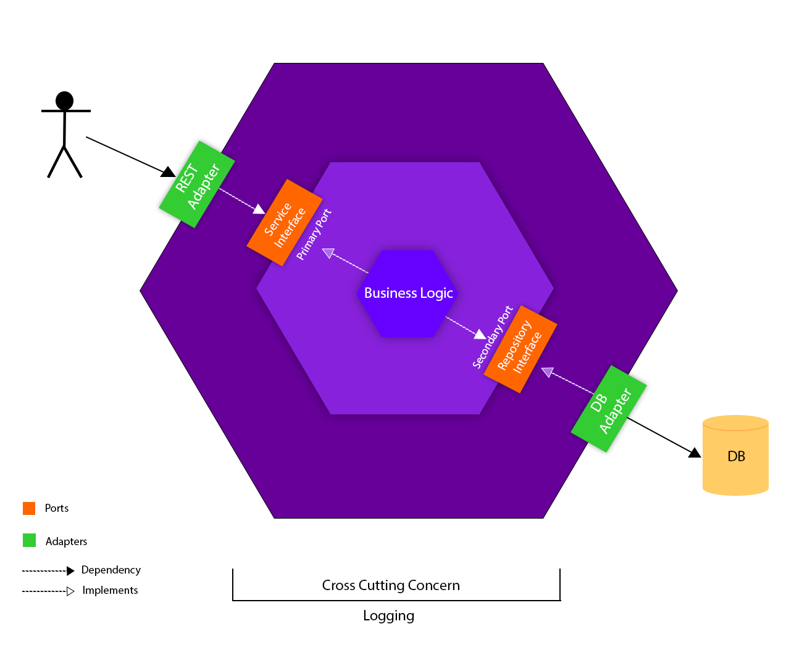

## Logger service

### Related Repos

https://github.com/mitriygor/usersProject — service for fetching data

https://github.com/mitriygor/usersProjectAuth — authentication service

### Description

The repository contain a service for logging errors and information. It is used as a cross-cutting concern for the fetching data service mentioned above.

The logger uses the Uber Zap: https://github.com/uber-go/zap